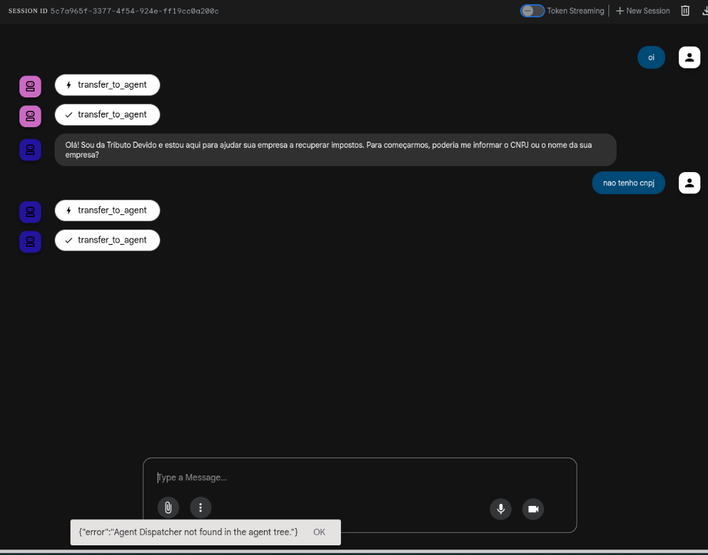

# Tributo Devido - Agente de Recuperação Tributária

Este projeto implementa um Sistema Multi-Agentes para auxiliar na recuperação tributária (PIS/COFINS) para empresas do Simples Nacional, utilizando o Google Agent Development Kit (ADK) e Vertex AI Search.



## Pré-requisitos

- Node.js (v18 ou superior)
- Google Cloud SDK (`gcloud`)

## Configuração do Ambiente

### 1. Instalação de Dependências

No diretório raiz do projeto, execute:

```bash
npm install
```

### 2. Autenticação e Configuração Google Cloud

Para que os agentes possam acessar a base de conhecimento no Vertex AI, siga estes passos rigorosamente:

**2.1 Pré-requisitos (Console)** Antes de rodar comandos localmente, garanta que seu projeto GCP esteja pronto:

1.  **Faturamento (Billing)**: Ative a conta de faturamento no console Google Cloud. Sem isso, as APIs da Vertex AI não funcionam (erro `FAILED_PRECONDITION`).
2.  **Data Store (Vertex AI Search)**:
    - Acesse [Vertex AI Agent Builder](https://console.cloud.google.com/gen-app-builder/engines).
    - Crie um novo App do tipo **Search**.
    - **Nome**: `Tributo Knowledge Base`.
    - **ID do Data Store**: `tributo-kb-id` (Essencial ser exato).
    - **Edição**: Standard ou Enterprise.
    - **Localização**: `us-central1` (ou global).

**2.2 Configuração Local (Script Auxiliar)**

Após configurar o console, execute o script para ativar as APIs e validar o ambiente:

```bash
./scripts/setup_gcp.sh
```

**2.3 Login e Geração de Credenciais (ADC)** Fundamental para o código rodar localmente:

```bash
sudo snap install google-cloud-cli --classic  # Se necessário
gcloud auth login                             # Login de gerenciamento
gcloud auth application-default login         # Credenciais para o código
```

_Nota: Confirme que o arquivo de credenciais foi salvo corretamente._

**2.3 Definir o Projeto Padrão**: Configure o CLI para usar o projeto correto da Tributo Devido:

```bash
gcloud config set project td-multi-agent-faq-1
```

### 3. Configuração de Variáveis (.env)

Certifique-se de que o arquivo `.env` existe na raiz do projeto com o seguinte conteúdo (ajuste se necessário):

```env
GOOGLE_CLOUD_PROJECT=td-multi-agent-faq-1
GOOGLE_CLOUD_LOCATION=us-central1
VERTEX_SEARCH_DATA_STORE_ID=tributo-kb-id
```

### 3. Como Rodar

Basta executar o comando abaixo. Ele compila o projeto e inicia a interface de depuração:

```bash
npm start
```

- **Acesse o navegador**: Uma URL será exibida (geralmente `http://localhost:8000`).
- **Interaja**: Digite "Oi" para falar com o Vendas ou faça uma pergunta técnica ("PIS monofásico...") para o Especialista.

### 4. Modelos Utilizados (Verificados)

Este projeto foi configurado e validado com as versões mais recentes disponíveis para sua chave (Gemini 2.5):

- **Gemini 2.5 Flash**: Usado para roteamento (Dispatcher) e interações rápidas (Vendas).
- **Gemini 2.5 Pro**: Usado para raciocínio complexo (Especialista Tributário e Auditor de Compliance).

_Nota: Se encontrar erros de "Model not found", verifique se sua chave API tem acesso a estas versões Beta/Experimental._

Isso irá:

1. Compilar o código TypeScript.
2. Iniciar o servidor de agentes.
3. Abrir o inspetor web (geralmente em `http://localhost:8000`), onde você pode conversar com o agente e visualizar o fluxo de execução ("Trace").

## Estrutura do Projeto

- `src/agents/`: Lógica dos agentes (Dispatcher, Especialista, Auditor, Vendas).
- `src/tools/`: Ferramentas (Conector RAG, Script de Ingestão).
- `src/index.ts`: Ponto de entrada da aplicação.
